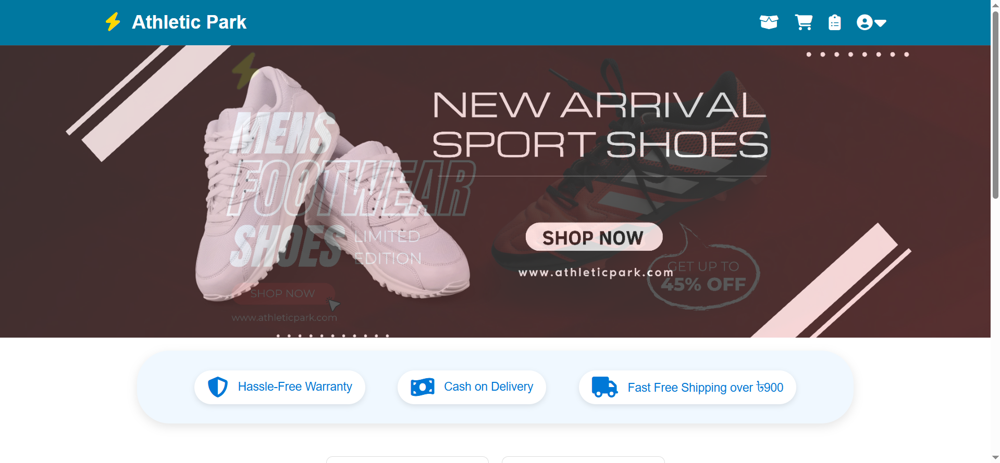
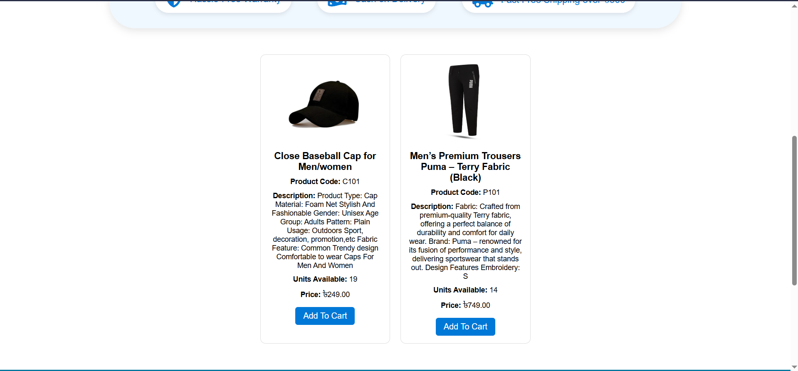
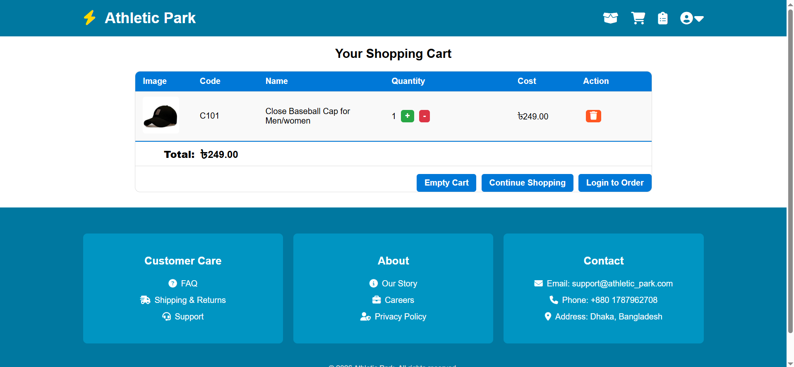
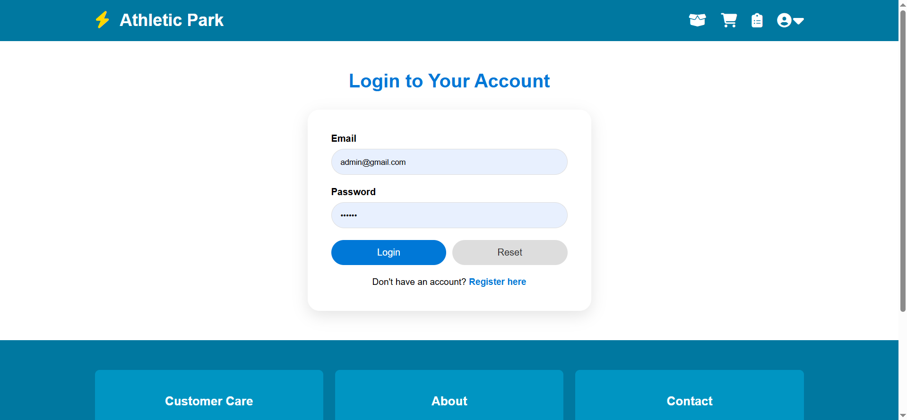
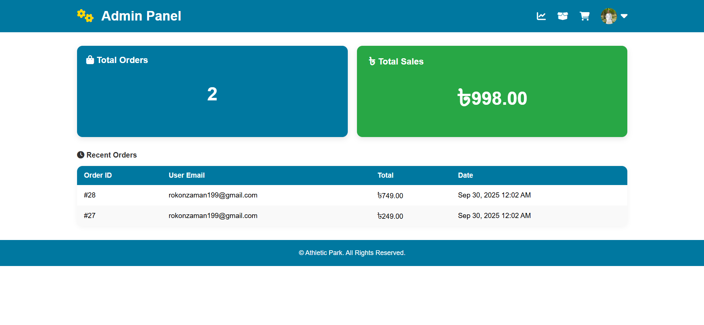
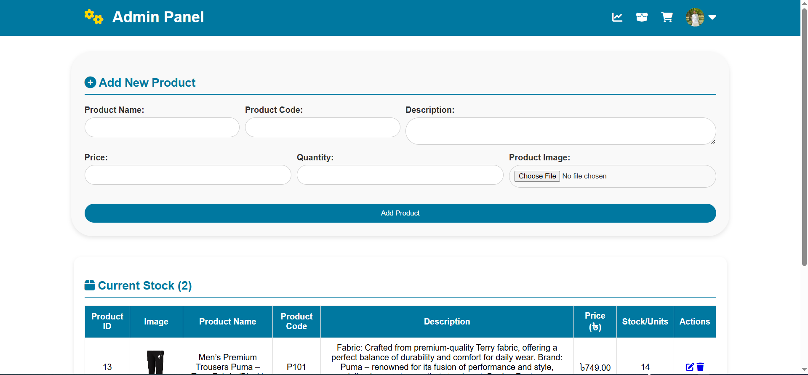
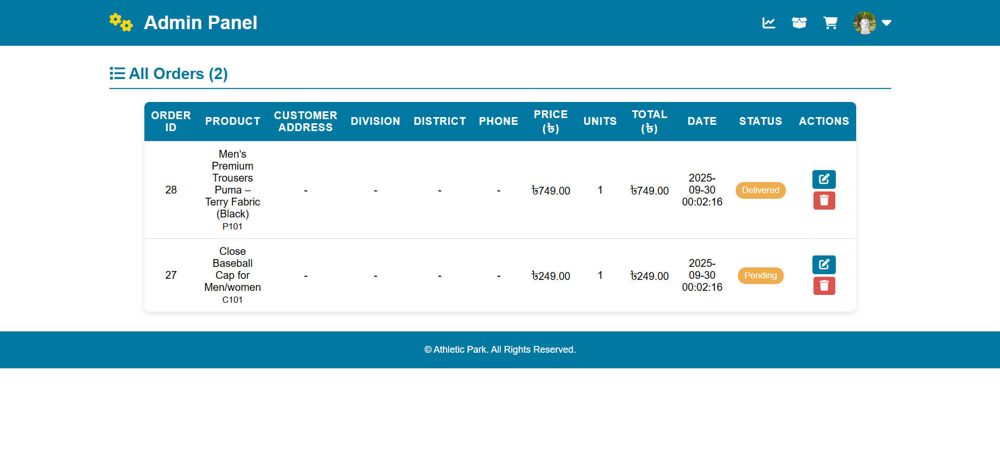

# Athletic Park

Athletic Park is a PHP-based eCommerce web application designed for managing and selling athletic products online.

---

## 🚀 Features

* User Authentication System
* Product Management
* Shopping Cart Functionality
* Order Management
* Admin Dashboard
* Profile Management
* Password Change System
* Responsive User Interface

---

## 🛠️ Technologies Used

* PHP
* MySQL
* HTML5
* CSS3
* JavaScript
* Foundation CSS Framework

---

## 📂 Project Structure

* `/admin` → Admin dashboard and management
* `/images` → Product and user images
* `/css` → Stylesheets
* `/js` → JavaScript files

---

## ⚙️ Installation Guide

### 1. Clone Repository

```bash
git clone https://github.com/pritommahmud38/athletic_park.git
```

### 2. Move Project

Place the folder inside:

```text
htdocs
```

(XAMPP)

---

### 3. Import Database

Import:

```text
athleticpark.sql
```

into phpMyAdmin.

---

### 4. Run Project

Start Apache & MySQL.

Open:

```text
http://localhost/athletic_park
```

---

## 📸 Screenshots

### Homepage


### Cart Page

### Login Page


### Admin Dashboard




---

## 👨‍💻 Author

### Pritom Mahmud

Full Stack Web Developer passionate about building modern web applications.

---

## 📜 License

This project is licensed under the MIT License.
